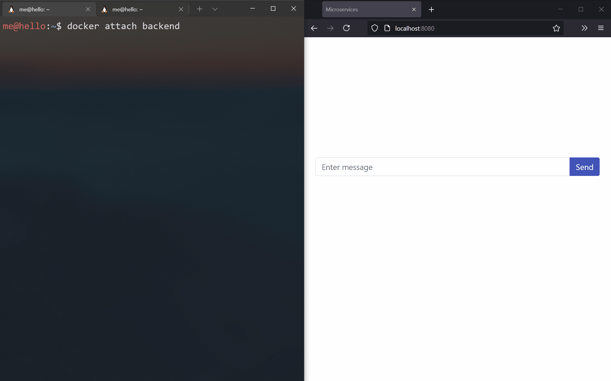

# Microservices

A basic example of a microservice architecture.

* Written in Go
* Uses RabbitMQ to communicate between services
* Uses WebSocket to talk to the front end
* Stores data in PostgreSQL
* Stores cache in Redis
* Uses React for front end development
* Builds with Docker
* Deployed on AWS with CI/CD



## Local use

To run the example locally, clone the Github repository and start the services using Docker Compose. Once Docker finishes downloading and building the images, the front end is accessible by visiting `localhost:8080`.

```bash
git clone https://github.com/ebosas/microservices
cd microservices
```
```bash
docker-compose up
```

## Deploy to Amazon ECS/AWS Fargate

From the `deployments` directory, create the pipeline stack. It will provision all the resources (network, cluster, etc.) and create a pipeline for each service. At this point, we have yet to build our service images.

```bash
aws cloudformation deploy \
    --stack-name Microservices \
    --template-file pipeline.yml \
    --parameter-overrides \
        EnvironmentName=msprod \
        LaunchType=Fargate \
        GitHubRepo=<github_repo_name> \
        GitHubBranch=<github_branch> \
        GitHubToken=<github_token> \
        GitHubUser=<github_user> \
    --capabilities CAPABILITY_NAMED_IAM
```

To build and deploy all services, push some changes to your repository with `[BuildAll]` added to the message. To trigger specific services, add `[BuildServer]`, `[BuildCache]`, or `[BuildDatabase]`.

Once finished, visit the URL of the load balancer. It is available in the LoadBalancer's Outputs tab in CloudFormation.

### Github repo setup

Fork or otherwise copy this repo to your Github account.

On the [Github access token page](https://github.com/settings/tokens), generate a new token with the following access:

* `repo`
* `admin:repo_hook`

### Deleting stacks

Delete stacks in reverse order in CloudFormation. The artifact bucket and ECR repositories need to be deleted manually. So as the auto scaling group (from the EC2 console) when using the EC2 launch type.

## Local resources

When running locally, inspect resources by launching relevant Docker containers.

<details>
  <summary>See details</summary>

### Database

To access the database, launch a new container that will connect to our Postgres database. Then enter the password `demopsw` (see the `.env` file).

```bash
docker run -it --rm \
    --network microservices_network \
    postgres:13-alpine \
    psql -h postgres -U postgres -d microservices
```

Select everything from the messages table:

```sql
select * from messages;
```

### Redis

To inspect Redis, connect to its container via redis-cli.

```bash
docker run -it --rm \
    --network microservices_network \
    redis:6-alpine \
    redis-cli -h redis
```

Get all cached messages or show the number of total messages.

```bash
lrange messages 0 -1
get total
```

### RabbitMQ

Access the RabbitMQ management interface by visiting `localhost:15672` with `guest` as both username and password.

### Back end

To access the back end service, attach to its docker container from a separate terminal window. Messages from the front end will show up here. Also, standart input will be sent to the front end for two way communication.

```bash
docker attach microservices_backend
```
</details>

## Local development

For development, run the RabbitMQ and Postgres containers with Docker Compose.

<details>
  <summary>See details</summary>

```bash
docker-compose -f docker-compose-dev.yml up
```

Generate static web assets for the server service by going to `web/react` and `web/bootstrap` and running:

```bash
npm run build-server
```

### React

For React development, run `npm run serve` in `web/react` and change the script tag in the server's template to the following:

```html
<script src="http://127.0.0.1:8000/index.js"></script>
```
</details>
